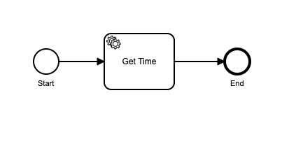
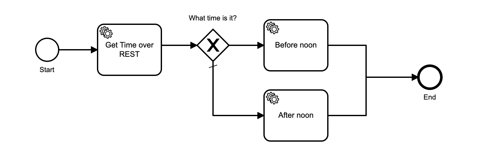

# Getting Started with Camunda Cloud using Java and Spring Zeebe

The [Spring Zeebe Client](https://github.com/zeebe-io/spring-zeebe) is available for Spring and Spring Boot applications. 

Watch a [video tutorial on YouTube](https://youtu.be/7vBxJmXD3Js) walking through this Getting Started Guide.

[](https://youtu.be/7vBxJmXD3Js)

## Prerequisites

* [Zeebe Modeler](https://github.com/zeebe-io/zeebe-modeler/releases)

## Scaffolding the project

* Download a maven Spring starter from [here](https://start.spring.io/#!type=maven-project&language=java&platformVersion=2.3.1.RELEASE&packaging=jar&jvmVersion=11&groupId=io.camunda&artifactId=cloudstarter&name=cloudstarter&description=Getting%20Started%20with%20Camunda%20Cloud%20and%20Spring%20Boot&packageName=io.camunda.cloudstarter&dependencies=webflux).

* Unzip it into a new directory.

[Video link](https://youtu.be/7vBxJmXD3Js?t=71)

* Add the [Spring Zeebe Client](https://github.com/zeebe-io/spring-zeebe) dependency to the `pom.xml` file:

```xml
<dependency>
    <groupId>io.zeebe.spring</groupId>
    <artifactId>spring-zeebe-starter</artifactId>
    <version>0.23.0</version>
</dependency>
```
[Video link](https://youtu.be/7vBxJmXD3Js?t=192)

## Create Camunda Cloud cluster

[Video link](https://youtu.be/7vBxJmXD3Js?t=233)

* Log in to [https://camunda.io](https://camunda.io).
* Create a new Zeebe 0.23.3 cluster.
* When the new cluster appears in the console, create a new set of client credentials. 
* Copy the client Connection Info environment variables block.

## Configure connection

[Video link](https://youtu.be/7vBxJmXD3Js?t=368)

* Add the client connection credentials for your cluster to the file `src/main/resources/application.properties`:

```
zeebe.client.cloud.clusterId=3b640f45-0dcd-469a-8551-7f68a5d4f53b
zeebe.client.cloud.clientId=rvQhH1LgzZ8hWxYpnX-WCFoqxl3ps6_o
zeebe.client.cloud.clientSecret=Y_tumI88mpbDbxlY0ueVyPK6BHjMAe5FpBtPU4TQPPyr4FuDxpMN7P9Mj7M26j6a
zeebe.client.worker.defaultName=myworker
```

* Save the file.

## Test Connection with Camunda Cloud

[Video link](https://youtu.be/7vBxJmXD3Js?t=436)

* Annotate the `CloudStarterApplication` class in the file `src/main/java/io.camunda/CloudStarterApplication.java` with 
the `@EnableZeebeClient` annotation, and add the `@Autowired` `ZeebeClientLifecycle` property:

```java
@SpringBootApplication
@EnableZeebeClient
public class CloudStarterApplication {
    	@Autowired
    	private ZeebeClientLifecycle client;
}
```

* Add the `@RestController` annotation to the class, and create a REST mapping that returns the cluster topology: 

```java
@SpringBootApplication
@RestController
@EnableZeebeClient
public class CloudStarterApplication {
    
	@Autowired
	private ZeebeClientLifecycle client;
	public static void main(String[] args) {
		SpringApplication.run(CloudStarterApplication.class, args);
	}

	@GetMapping("/status")
	public String getStatus() {
		Topology topology = client.newTopologyRequest().send().join();
		return topology.toString();
	}
}
```

* Run the application with the command `mvn spring-boot:run`.

* Open [http://localhost:8080/status](http://localhost:8080/status) in your web browser.

You will see the topology response from the cluster.

## Create a BPMN model

[Video link](https://youtu.be/7vBxJmXD3Js?t=900)

* Download and install the [Zeebe Modeler](https://github.com/zeebe-io/zeebe-modeler/releases).
* Open Zeebe Modeler and create a new BPMN Diagram.
* Create a new BPMN diagram.
* Add a StartEvent, an EndEvent, and a Task.
* Click on the Task, click on the little spanner/wrench icon, and select "Service Task".
* Set the _Name_ of the Service Task to `Get Time`, and the _Type_ to `get-time`.

It should look like this:



* Click on the blank canvas of the diagram, and set the _Id_ to `test-process`, and the _Name_ to "Test Process".
* Save the diagram to `src/main/resources/test-process.bpmn` in your project.

## Deploy the BPMN model to Camunda Cloud

[Video Link](https://youtu.be/7vBxJmXD3Js?t=1069)

* Edit the `src/main/java/io.camunda/CloudStarterApplication.java` file, and add the `@ZeebeDeployment` annotation to the 
`CloudStarterApplication` class:

```java
// ...
@ZeebeDeployment(classPathResources = {"test-process.bpmn"})
public class CloudStarterApplication {
    // ...
}
```

## Start a Workflow Instance

[Video Link](https://youtu.be/7vBxJmXD3Js?t=1093)

* Edit the `src/main/java/io.camunda/CloudStarterApplication.java` file, and add a REST method to start an instance
of the workflow:

```java
// ...
public class CloudStarterApplication {
    // ...

    @GetMapping("/start")
    public String startWorkflowInstance() {
        WorkflowInstanceEvent workflowInstanceEvent = client
            .newCreateInstanceCommand()
            .bpmnProcessId("test-process")
            .latestVersion()    
            .send()
            .join();
        return workflowInstanceEvent.toString();
    }
}
```

* Run the program with the command: `mvn spring-boot:run`.

* Visit [http://localhost:8080/start](http://localhost:8080/start) in your browser.

You will see output similar to the following: 

```
CreateWorkflowInstanceResponseImpl{workflowKey=2251799813685249, bpmnProcessId='test-process', version=1, workflowInstanceKey=2251799813698314}
``` 

A workflow instance has been started. Let's view it in Operate.

## View a Workflow Instance in Operate

[Video Link](https://youtu.be/7vBxJmXD3Js?t=1223)

* Go to your cluster in the [Camunda Cloud Console](https://camunda.io).
* In the cluster detail view, click on "_View Workflow Instances in Camunda Operate_".
* In the "_Instances by Workflow_" column, click on "_Test Process - 1 Instance in 1 Version_".
* Click the Instance Id to open the instance.
* You will see the token is stopped at the "_Get Time_" task.

Let's create a task worker to serve the job represented by this task.

## Create a Job Worker

[Video Link](https://youtu.be/7vBxJmXD3Js?t=1288)

We will create a worker program that logs out the job metadata, and completes the job with success.

* Edit the `src/main/java/io.camunda/CloudStarterApplication.java` file, and add a REST method to start an instance
of the workflow:

```java
// ...
public class CloudStarterApplication {
	Logger logger = LoggerFactory.getLogger(CloudStarterApplication.class);

    // ...
    	@ZeebeWorker(type = "get-time")
    	public void handleGetTime(final JobClient client, final ActivatedJob job) {
    		logger.info(job.toString());
    		client.newCompleteCommand(job.getKey())
    				.send().join();
    	}
}
```

* Run the worker program with the command: `mvn spring-boot:run`.

You will see output similar to: 

```
2020-06-29 09:33:40.420  INFO 5801 --- [ault-executor-1] io.zeebe.client.job.poller               : Activated 1 jobs for worker whatever and job type get-time
2020-06-29 09:33:40.437  INFO 5801 --- [pool-2-thread-1] i.c.c.CloudStarterApplication            : {"key":2251799813698319,"type":"get-time","customHeaders":{},"workflowInstanceKey":2251799813698314,"bpmnProcessId":"test-process","workflowDefinitionVersion":1,"workflowKey":2251799813685249,"elementId":"Activity_1ucrvca","elementInstanceKey":2251799813698318,"worker":"whatever","retries":3,"deadline":1593380320176,"variables":"{}","variablesAsMap":{}}
```

* Go back to Operate. You will see that the workflow instance is gone.
* Click on "Running Instances".
* In the filter on the left, select "_Finished Instances_".

You will see the completed workflow instance.

## Create and Await the Outcome of a Workflow Instance 

[Video Link](https://youtu.be/7vBxJmXD3Js?t=1616)

We will now create the workflow instance, and get the final outcome in the calling code.

* Edit the `src/main/java/io.camunda/CloudStarterApplication.java` file, and edit the `startWorkflowInstance` method, 
to make it look like this:

```java
// ...
public class CloudStarterApplication {
    // ...

    @GetMapping("/start")
    public String startWorkflowInstance() {
		WorkflowInstanceResult workflowInstanceResult = client
            .newCreateInstanceCommand()
            .bpmnProcessId("test-process")
            .latestVersion()
            .withResult()
            .send()
            .join();
		return workflowInstanceResult.toString();
    }
}
```

* Run the program with the command: `mvn spring-boot:run`.

* Visit [http://localhost:8080/start](http://localhost:8080/start) in your browser.

You will see output similar to the following:

```
CreateWorkflowInstanceWithResultResponseImpl{workflowKey=2251799813685249, bpmnProcessId='test-process', version=1, workflowInstanceKey=2251799813698527, variables='{}'}
```

## Call a REST Service from the Worker 

[Video link](https://youtu.be/7vBxJmXD3Js?t=1845)

* Edit the `src/main/java/io.camunda/CloudStarterApplication.java` file, and edit the `handleGetTime` method, 
to make it look like this:

```java
// ...
public class CloudStarterApplication {
    // ...

	@ZeebeWorker(type = "get-time")
	public void handleGetTime(final JobClient client, final ActivatedJob job) {
		final String uri = "https://json-api.joshwulf.com/time";

		RestTemplate restTemplate = new RestTemplate();
		String result = restTemplate.getForObject(uri, String.class);

		client.newCompleteCommand(job.getKey())
				.variables("{\"time\":" + result + "}")
				.send().join();
	}
}
```

* Run the program with the command: `mvn spring-boot:run`.
* Visit [http://localhost:8080/start](http://localhost:8080/start) in your browser.

You will see output similar to the following:

```
CreateWorkflowInstanceWithResultResponseImpl{workflowKey=2251799813685249, bpmnProcessId='test-process', version=1, workflowInstanceKey=2251799813698527, variables='{"time":{"time":"Sun, 28 Jun 2020 21:49:48 GMT","hour":21,"minute":49,"second":48,"day":0,"month":5,"year":2020}}'}
```

## Make a Decision 

[Video link](https://youtu.be/7vBxJmXD3Js?t=2066)

We will edit the model to add a Conditional Gateway.

* Open the BPMN model file `bpmn/test-process.bpmn` in the Zeebe Modeler.
* Drop a Gateway between the Service Task and the End event.
* Add two Service Tasks after the Gateway.
* In one, set the _Name_ to `Before noon` and the _Type_ to `make-greeting`.
* Switch to the _Headers_ tab on that Task, and create a new Key `greeting` with the Value `Good morning`.
* In the second, set the _Name_ to `After noon` and the _Type_ to `make-greeting`.
* Switch to the _Headers_ tab on that Task, and create a new Key `greeting` with the Value `Good afternoon`.
* Click on the arrow connecting the Gateway to the _Before noon_ task.
* Under _Details_ enter the following in _Condition expression_: 

```
=time.hour >=0 and time.hour <=11
```

* Click on the arrow connecting the Gateway to the _After noon_ task. 
* Click the spanner/wrench icon and select "Default Flow".
* Connect both Service Tasks to the End Event.

It should look like this:

  

## Create a Worker that acts based on Custom Headers 

[Video link](https://youtu.be/7vBxJmXD3Js?t=2399)

We will create a second worker that takes the custom header and applies it to the variables in the workflow.

* Edit the `src/main/java/io.camunda/CloudStarterApplication.java` file, and add the `handleMakeGreeting` method, 
to make it look like this:

```java
// ...
public class CloudStarterApplication {
    // ...

	@ZeebeWorker(type = "make-greeting")
	public void handleMakeGreeting(final JobClient client, final ActivatedJob job) {
		Map<String, String> headers = job.getCustomHeaders();
		String greeting = headers.getOrDefault("greeting", "Good day");
		Map<String, Object> variablesAsMap = job.getVariablesAsMap();
		String name = (String) variablesAsMap.getOrDefault("name", "there");
		String say = greeting + " " + name;
		client.newCompleteCommand(job.getKey())
				.variables("{\"say\": \"" + say + "\"}")
				.send().join();
	}
}
```

* Edit the `startWorkflowInstance` method, and make it look like this:

```java
// ...
public class CloudStarterApplication {
    // ...
    @GetMapping("/start")
    public String startWorkflowInstance() {
        WorkflowInstanceResult workflowInstanceResult = client
                .newCreateInstanceCommand()
                .bpmnProcessId("test-process")
                .latestVersion()
                .variables("{\"name\": \"Josh Wulf\"}")
                .withResult()
                .send()
                .join();
        return (String) workflowInstanceResult
                .getVariablesAsMap()
                .getOrDefault("say", "Error: No greeting returned");
    }
}
```

You can change the variable `name` value to your own name (or derive it from the url path or a parameter).

* Run the program with the command: `mvn spring-boot:run`.
* Visit [http://localhost:8080/start](http://localhost:8080/start) in your browser.

You will see output similar to the following:

```
Good Morning Josh Wulf
```

## Profit!

Congratulations. You've completed the Getting Started Guide for Camunda Cloud using Java with Spring.

