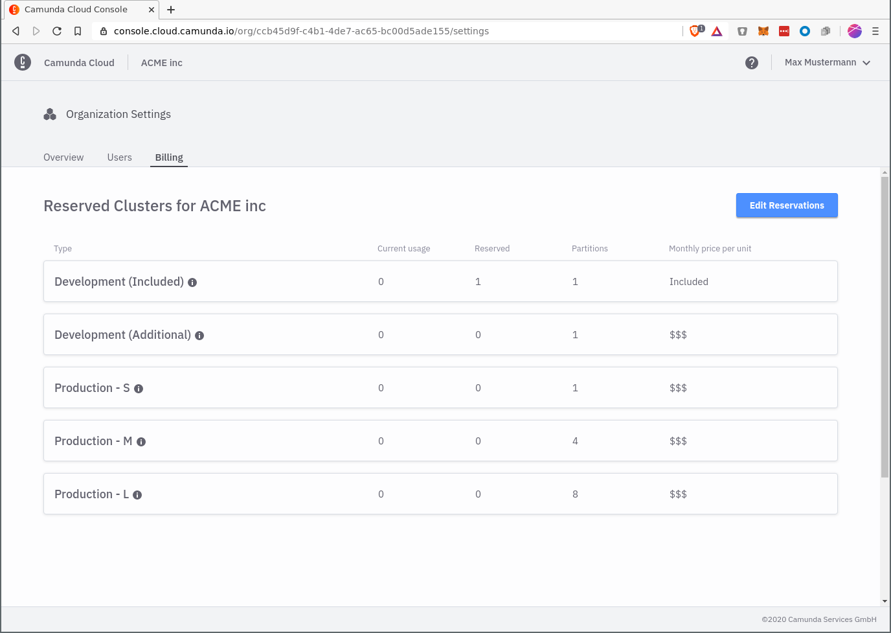

A Camunda Sales Accountant will go through your desired Early Access Plan configuration with you. There will be certain cluster plan configurations that differ in technical parameters (such as number of partitions, memory sizes, etc.). If you wish to have a different parameterization, you can discuss this with your accountant.

Then you and your accountant will define the maximum number of clusters that can be reserved per cluster configuration. You can change the maximum limit in the future via your accountant.

As soon as your Early Access Plan is active you will find the entry "Reserved Clusters" in the Camunda Cloud Console via the navigation menu. On this page you will find an overview of your Early Access Plan:

* **Type**: Name of the cluster configuration
* **Current Usage**: Number of clusters created per cluster configuration
* **Reserved**: Number of reserved clusters. This value is important for [billing](./earlyaccess_billing.md). Users in your organization cannot create more clusters per cluster configuration than specified by this value.
* **Partitions**: Number of partitions specified in the cluster configuration
* **Monthly price per unit**: Price for each cluster of the corresponding cluster configuration

## Edit Reservations

The number of reserved clusters can be changed with the Edit button. The number of reserved clusters cannot exceed the maximum limit.

