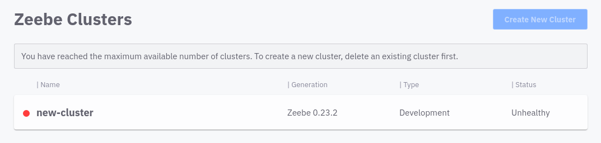
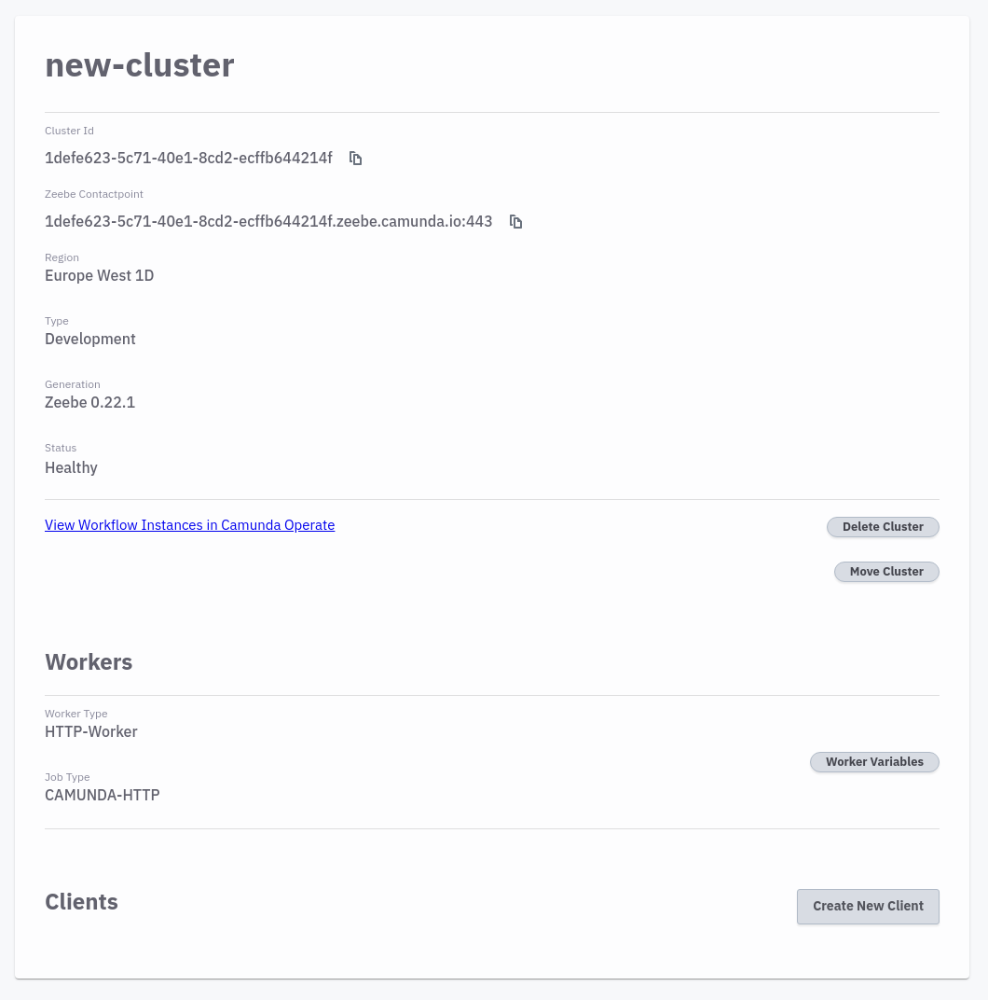

# Quick start

This section helps you to get up and running with your first Camunda Cloud Cluster using `zbctl`, in only minutes!

The steps to get started:

1. Sign up for Camunda Cloud
2. Install `zbctl`
3. Login to your Camunda Cloud account
4. Create a cluster
5. Create a client
6. Deploy your first workflow
7. Start a new instance

## Sign up for Camunda Cloud

Create a Camunda Cloud account for yourself, so that you can create clusters, deploy workflows and create a new instance.

### Visit [https://accounts.cloud.camunda.io/signup](https://accounts.cloud.camunda.io/signup)

The **Sign Up** screen appears:


### Fill in the form and submit

After you have filled out and sent the form you will receive a confirmation e-mail. Click on the link to verify your e-mail address and set your password.

## Install `zbctl`

`zbctl` is the command line tool that allows you to interact with a Zeebe Broker. Install `zbctl` via [npm](https://www.npmjs.com/package/zbctl):

```bash
npm i zbctl
```

Print the version to make sure that `zbctl` was installed:

```bash
zbctl version
```

## Login to your Camunda Cloud account

### Visit [https://camunda.io](https://camunda.io)

Log in with your e-mail address and password:


## Create a cluster

After login you will see the console overview page. Since you have not yet created a cluster, the overview is empty.

In the upper right area you will find the button Create new Cluster. Click on it to create a new cluster. After you have assigned a name and created the cluster, a new entry appears in the overview:



The cluster is now being set up. During this phase, its state is *unhealthy*. After one or two minutes the cluster is ready for use and changes its state to *healthy*:


## Create a client

To create a new client you have to jump to the detail view. Click on the created cluster. In the lower area you will find the Client section:



Click on *Create new client* to create a new client, name your client accordingly:


In the next step you will see all information you need to connect:

* `ZEEBE_ADDRESS`: Address where your cluster can be reached.
* `ZEEBE_CLIENT_ID` and `ZEEBE_CLIENT_SECRET`: Credentials to request a new access token.
* `ZEEBE_AUTHORIZATION_SERVER_URL`: A new token can be requested at this address using the credentials.


You can now copy the connection info to your terminal and export the environment variables. `zbctl` will use these environment variables to connect to Zeebe.

## Deploy your first workflow

All requirements are met to communicate with Zeebe in the cloud.

Test the connection by printing out the topology:

```bash
zbctl status
```

As a result you will get a similar result:

```bash
Cluster size: 1
Partitions count: 2
Replication factor: 1
Gateway version: unavailable
Brokers:
  Broker 0 - zeebe-0.zeebe-broker-service.456637ef-8832-428b-a2a4-82b531b25635-zeebe.svc.cluster.local:26501
    Version: unavailable
    Partition 1 : Leader
    Partition 2 : Leader
```

Now you can deploy a new workflow. You can use this demo workflow for this:

[](./assets/gettingstarted_quickstart.bpmn)

Download the [BPMN model](assets/gettingstarted_quickstart.bpmn) and change into the directory. The workflow uses the embedded HTTP worker in the cloud to submit an HTTP Get Request to [https://jsonplaceholder.typicode.com/posts](https://jsonplaceholder.typicode.com/posts). Next deploy the model with the following command:

```bash
zbctl deploy gettingstarted_quickstart.bpmn
```

If the deployment is successful you will get the following output:

```bash
{
  "key": 2251799813685264,
  "workflows": [
    {
      "bpmnProcessId": "camunda-cloud-quick-start",
      "version": 1,
      "workflowKey": 2251799813685263,
      "resourceName": "gettingstarted_quickstart.bpmn"
    }
  ]
}
```

Important here is the `bpmnProcessId`, which you will need for creating a new instance.

## Start a new instance

Starting a new instance is done with a single command:

```bash
zbctl create instance camunda-cloud-quick-start
```

As a result you will get the following output, which contains among others the `workflowInstanceKey`:

```bash
{
  "workflowKey": 2251799813685263,
  "bpmnProcessId": "camunda-cloud-quick-start",
  "version": 1,
  "workflowInstanceKey": 4503599627370519
}
```

Now switch back to the cluster detail view of Camunda Cloud Console. Right after the cluster information you will find a link called *View Workflow Instances in Camunda Operate*. Click on this link to jump to Operate. You will now see the Operate Dashboard. The available workflows are listed in the lower left area. You have deployed the workflow *Camunda Cloud Quick start*.


Click on the deployed workflow to view all instances of it:


In the upper area you will find the graphical representation of your workflow. In the lower area you can see all instances. Your created instance with the `workflowInstanceKey` from above (in this case `4503599627370519`) is the only one available.
