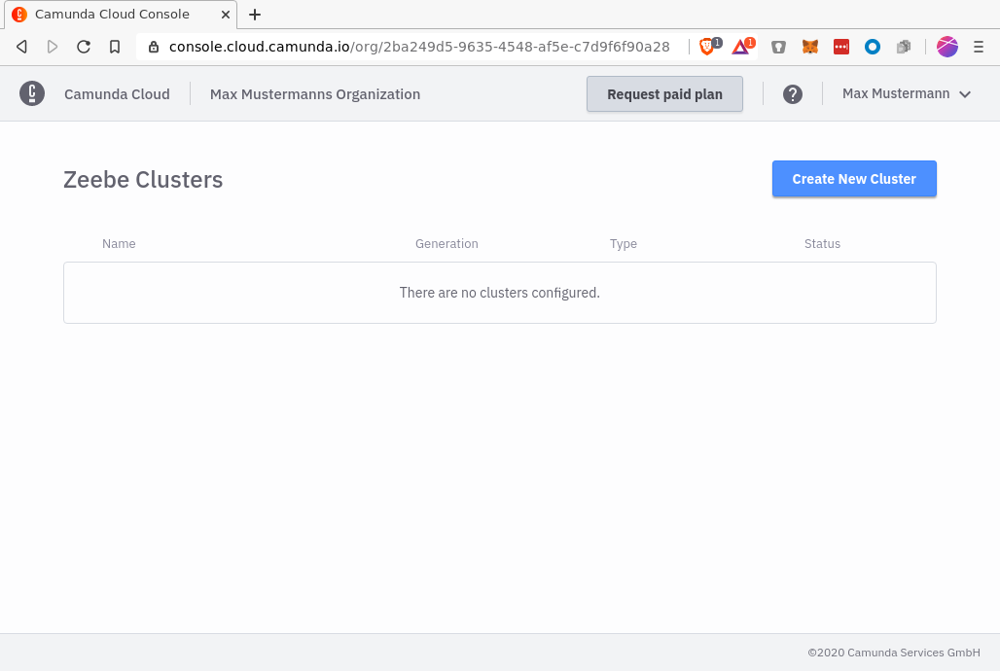
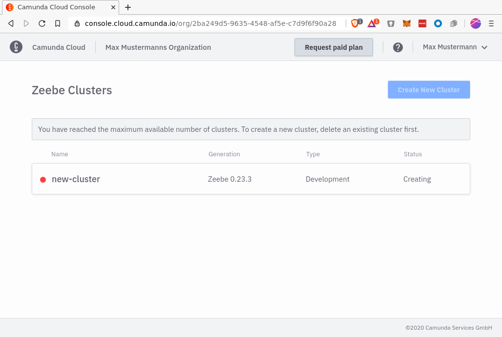
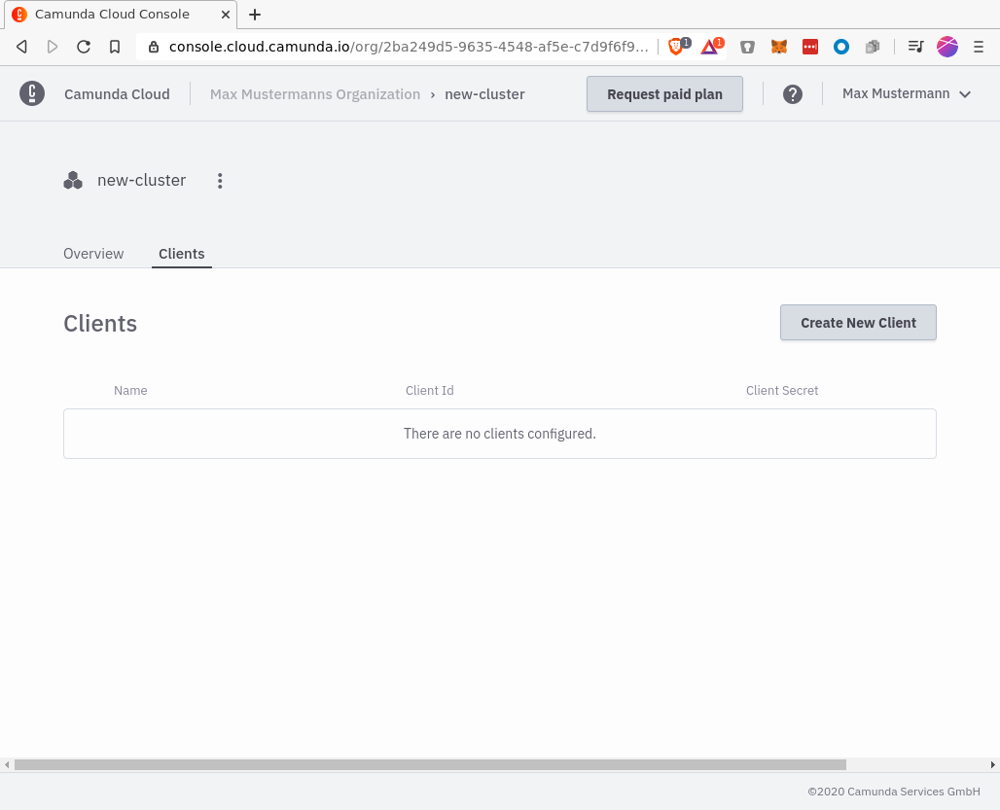

This section helps you get up and running in minutes with your first Camunda Cloud Cluster using Zeebe Modeler!

These steps will get you started:

1. Sign up for Camunda Cloud
2. Login to your Camunda Cloud account
3. Create a cluster
4. Create a client
5. Install Zeebe Modeler
6. Deploy your first workflow
7. Start a new instance

## Sign up for Camunda Cloud

Create a Camunda Cloud account for yourself, so that you can create clusters, deploy workflows and create a new instance.

### Visit [https://accounts.cloud.camunda.io/signup](https://accounts.cloud.camunda.io/signup)

The **Sign Up** screen appears:

### Fill in the form and submit

After you've filled in and sent the form, you'll receive a confirmation e-mail. Click on the link to verify your e-mail address and set your password.

## Login to your Camunda Cloud account

### Visit [https://camunda.io](https://camunda.io)

Log in with your e-mail address and password:

## Create a cluster

After login you'll see the console overview page. Since you haven't created a cluster, the overview will be empty.

In the upper right area you'll find the button _Create New Cluster_. Click on it to create a new cluster. After you've assigned a name and created the cluster, a new entry appears in the overview:

The cluster is now being set up. During this phase, its state is _Creating_. After one or two minutes the cluster is ready for use and changes its state to _Healthy_:

After the cluster has been created, you can jump into the cluster detail page by clicking on the newly created cluster.

## Create a client

To create a new client you have to navigate into the API tab:

Click on _Create New Client_-Button to create a new client, name your client accordingly:

The newly created client appears in the list. Click on `Connection Information` to get all the information you need to connect:

- `ZEEBE_ADDRESS`: Address where your cluster can be reached.
- `ZEEBE_CLIENT_ID` and `ZEEBE_CLIENT_SECRET`: Credentials to request a new access token.
- `ZEEBE_AUTHORIZATION_SERVER_URL`: A new token can be requested at this address, using the credentials.

You can use the `Copy` button to get all of this into your clipboard so you can paste it into your terminal later.

## Install Zeebe Modeler

The Zeebe Modeler is a desktop application for modeling Zeebe Workflows with BPMN. Download the [latest release](https://github.com/zeebe-io/zeebe-modeler/releases) and start the application.

## Deploy your first workflow

Using the Zeebe Modeler, workflows can be deployed and new instances created.

Download the [BPMN model](assets/gettingstarted_quickstart.bpmn) and open it with the Zeebe Modeler.

It's the simplest model with one start and one end event.

On the right side of the navigation menu there are buttons for deploying and starting workflows.

In the deployment dialog, the connection information must now be specified: ClusterId, ClientId and ClientSecret. Click Deploy to deploy the workflow now. Use the Play button from the navigation to start a new instance.

Now switch back to the cluster detail view of Camunda Cloud Console. Right after the cluster information you will find a link called _View Workflow Instances in Camunda Operate_. Click on this link to jump to Operate. You will now see the Operate Dashboard. The available workflows are listed in the lower left area. You have deployed the workflow _Camunda Cloud Quick start_!

Click on the deployed workflow to view all instances of it:

In the upper area you will find the graphical representation of your workflow. In the lower area you can see all instances.

Congratulations, you have deployed a first workflow and started an instance. In the [advanced Quick Start](./connectzeebe_cli-zbctl.md) you will learn how to register and use your own worker.
